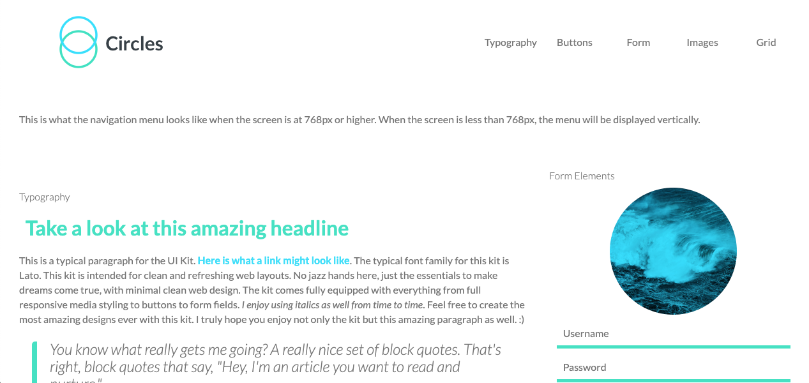
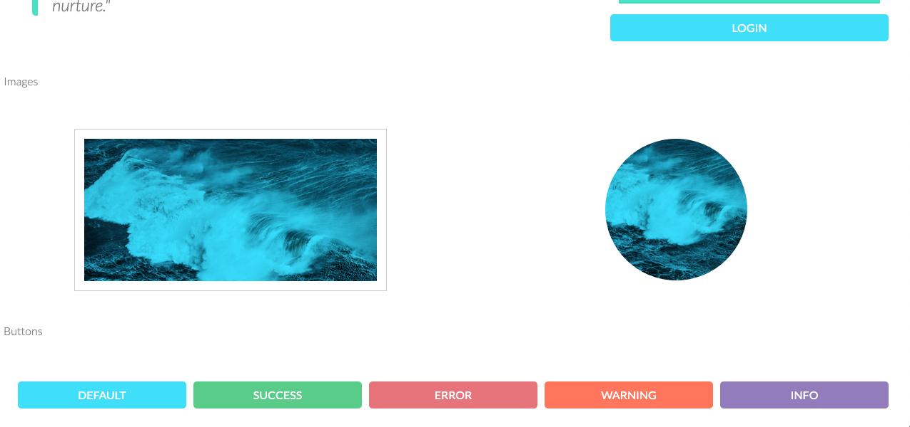
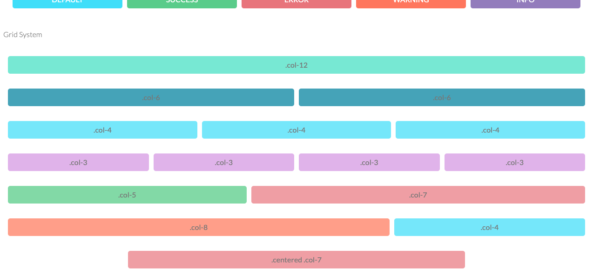

# Web_Style_Guide_Techdegree
**Web_Style__Guide_techdegree** 

This is a web style guid build with scss.

The media-query breakpoint is 768px.

You can visit the live version at [https://allan9595.github.io/style_guide_treehouse/](https://allan9595.github.io/style_guide_treehouse/)

## How to run on the local machine

git clone https://github.com/allan9595/style_guide_treehouse.git

Go to the folder then open the index.html file in browser. 

## Screenshots

